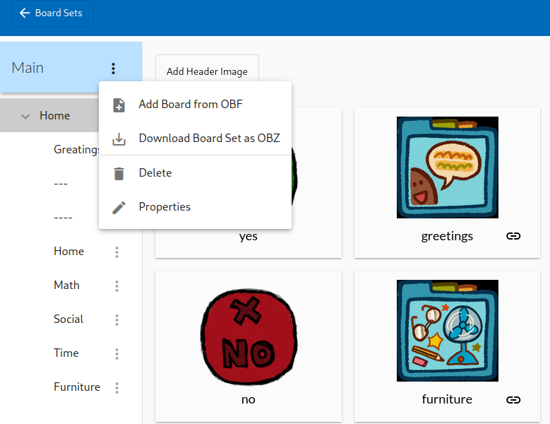

# AACpp

An AAC (Augmentative and Alternative Communication) Board Player written in C++
that's intended to work with [Board Builder](https://app.globalsymbols.com/en/)
and other apps which export ".obz" files. This app should be 100% free to all
users, check out the license for more details.

**This project isn't done**, but I'm actively working on it. When this project
will be mostly done, check out
[Releases](https://github.com/DaApppooo/AACpp/releases) to download and install
it on your *Machine*. Check out [dependencies](#deps) if you want to
try it out early. When the first release will come out, I'd like to have a
linux, windows and android version available. **Once done** this project will
continue to evolve with suggestion coming from users.

Please note that I'm not a full-time AAC user (and I actually use aacs very
rarely), so what I'm creating might not be adapted to your needs (and might
even be unusable). If there's anything of that sort, or some feature you'd like
me to implement, please post a [feature request](https://github.com/DaApppooo/AACpp/issues/new?assignees=DaApppooo&labels=&projects=&template=feature-request.md&title=)
explaining what you want or need.

It uses [Raylib](https://github.com/raysan5/raylib/) for general window
operations, input, etc..., mostly [Clay](https://github.com/nicbarker/clay) for
layout (waiting for the grid feature to use it for everything), and stb_image
to fix some problems with raylib. To ask for files,
[Native File Dialog](https://github.com/mlabbe/nativefiledialog) was used.

## Usage

First step is to create your own board set on
[Board Builder](https://app.globalsymbols.com/en/). This program supports most
of Board Builder features, except (for now) border color, background color and
custom label position.

> [!CAUTION]
> Make sure the cells/buttons that are linked to another board **have the same
> exact name as the board they're linked to**. This is because Board Builder
> does not support proper board linkage in the `.obz` format. So this should be
> temporary. I sent them an email about this, hoping this will be fixed soon
> enough.

When your board is done, download your board set as `OBZ`:

Then launch this program. A file selection window should appear. Select the
the file you just downloaded. After at most a few seconds of loading and
compiling everything needed, you should get the board set you just created
ready to be used.

In case of any problems, see [Q&A](#qna).

<a name="deps" />

## Dependencies

In order to build from source, you'll need a few things:

- raylib dynamic library (referenced higher up in this document)

- [python 3](https://www.python.org/downloads/) (version >= 3.10)

> [!IMPORTANT]
> Please note that native file dialog library is shipped as a static
  library available in the `lib` folder when cloning this repository. But
  should be recompiled for your system

> [!TIP]
> To install the last release of clay and compile nativefiledialog for your
  system you can simply run `make clean && make deps`.

To run the program without installing a release, you'll need:

- raylib dynamic library (referenced higher up in this document)
- an adapted release of nativefiledialog compiled for your system
- python 3
- python [pillow](https://pypi.org/project/pillow/)
- to declare a TTS environment variable on linux or on windows, that contains a
  command which reads on the standard input the text to be said, and outputs as
  audio what was said.

## What feature of `obz` is supported ?

Ideally, every feature of the `obz` file format + every custom feature Board
Builder might offer. Feature requests will mostly help me know on which feature
I should work in priority. Check out the [todo](https://github.com/users/DaApppooo/projects/1) to see how the project is
going, and what you can contribute to if you want to.

<a name="qna">

## Q&A

> The program doesn't produce any sound.
- It's most likely that your system doesn't have a default TTS client. In this
  case, if you're on linux or windows, you need to have a `TTS` environement
  variable. For android or iOS, please file an [issue](https://github.com/DaApppooo/AACpp/issues/new?assignees=DaApppooo&labels=&projects=&template=bug--or-problem-with-default-behavior-in-general--report.md&title=)

> After fixing all of the above, it still doesn't work on my system.
- Please take the time to write an
  [issue](https://github.com/DaApppooo/AACpp/issues/new?assignees=DaApppooo&labels=&projects=&template=bug--or-problem-with-default-behavior-in-general--report.md&title=)

